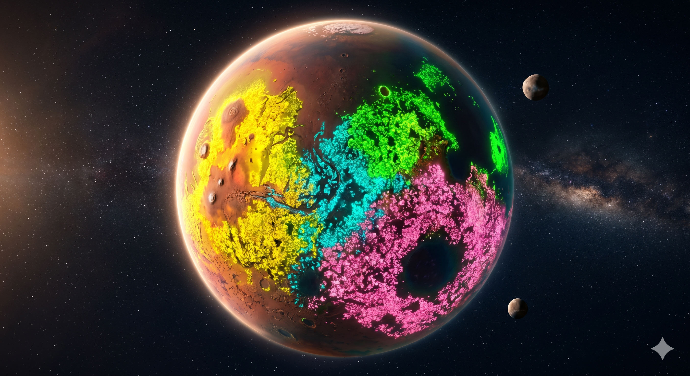

# 🔴 RedRoots: Mars Game of Life

**[🚀 Jetzt direkt im Browser spielen!](https://deepthoughtzero.github.io/RedRoots/)**



RedRoots ist ein rundenbasiertes, kompetitives Strategiespiel, das auf **Conway's Game of Life** aufbaut. Das Spielgeschehen ist in ein packendes Sci-Fi-Szenario auf dem Mars eingebettet: Spieler übernehmen die Rolle von Siedlern, die im Wettbewerb miteinander wuchern und versuchen, durch cleveres Platzieren von lebenden Zellen (Pflanzen) die Lager der gegnerischen Siedler zu überwuchern.

## 🌌 Die Geschichte: Der Kampf um die roten Wurzeln
Im Jahr 2148 ist die Oberfläche des Mars nicht mehr nur roter Staub. Forscher haben die "Mars-Flora" entdeckt — eine genetisch instabile, aber extrem schnell wachsende Vegetation, die sich nach den mathematischen Gesetzen von *Conway's Game of Life* verhält. 

Vier große Fraktionen, die **Häuser des Mars**, kämpfen nun um die fruchtbarsten Sektoren:
- **Haus Marineris (Cyan)**: Die Entdecker der großen Gräben.
- **Haus Hellas (Pink)**: Industrielle Tiefkrater-Bewohner.
- **Haus Viridion (Grün)**: Meister der Bio-Engineers und Terraformer.
- **Haus Tharsis (Gelb)**: Mächtige Broker aus den vulkanischen Regionen.

Übernimm das Kommando über eine dieser Fraktionen und nutze die Biologische Kriegsführung, um den Planeten für dein Haus zu beanspruchen.

## ✨ Features

- **Kompetitiver Multiplayer:** Spiele gegen bis zu 3 Freunde im Hot-Seat-Modus an einem Gerät oder trete gegen Computergegner (KI) an.
- **Drei Schwierigkeitsstufen:** Die KI der Häuser agiert unterschiedlich — von einfachen Gleitern bis hin zu komplexen Gleiter-Kanonen.
- **Strategische Runden:** Nutze ein zugeteiltes Zell-Budget, um komplexe Figuren (Gleiter, Raumschiff, R-Pentomino) in deinem eigenen Territorium zu platzieren.
- **Marsfelsen & Gebirge:** Prozedural generierte Bergketten blockieren die Vegetation und erfordern kluges Umschiffen der natürlichen Barrieren.
- **Dynamische Territorien:** Nach jeder Runde erobern überlebende Zellen automatisch neues Gebiet für dich. Überschneiden sich Einflussbereiche, entsteht Niemandsland.
- **Optimierte Performance:** Endlosschleifen (periodische Zustände) werden automatisch erkannt und übersprungen.
- **Cross-Platform:** Voller Touch-Support für Tablets und mobile Endgeräte (Pinch-to-Zoom, Wischen & Tippen).
- **Aesthetic UI:** Modernes Design mit Glassmorphismus, leuchtenden Laserlinien (Brennlinien) und Neon-Akzenten.

## 🚀 Spielstart

Das Spiel besteht aus purem HTML, CSS und JavaScript. Es werden keine externen Server, Datenbanken oder Build-Tools benötigt!

1. Klone dieses Repository oder lade es als ZIP herunter.
2. Öffne die Datei `index.html` in einem modernen Webbrowser.
3. Wähle **Kampagne**, **Freies Gefecht** oder **Sandbox** im Startmenü. Die Häuserauswahl erscheint erst unter **Freies Gefecht**; stelle dort jedes Haus ausdrücklich auf **Mensch** oder **Computer**.
4. Im freien Gefecht wählst du die menschlich gespielten Häuser und klickst auf **Gefecht starten**. Die erweiterten Einstellungen erreichst du wie bisher mit fünf Klicks auf den Setup-Titel.

## 🎮 Spielregeln & Steuerung

- **Ziel:** Erreiche das feindliche, schraffiert markierte Lager (in den Ecken). Wer das Lager infiltriert, gewinnt den Sektor für sein Haus!
- **Tablet & Handy:** Muster auswählen und auf das Spielfeld tippen. Mit zwei Fingern zoomen/verschieben oder die Tasten **− / Einpassen / +** verwenden. Die Werkzeugleiste liegt im Hochformat unten und auf schmalen Querformat-Bildschirmen rechts. Die Marskarte bietet zusätzlich eine große Missionsliste.
- **Steuerung (Maus):** 
  - `Linksklick`: Figur platzieren
  - `Mausrad halten`: Kamera verschieben
  - `Mausrad scrollen`: Zoom
  - `R` oder `Rechtsklick`: Figur rotieren
  - `Strg+Z`: Rückgängig
- **Überleben:** Conway's Game of Life Kernregeln gelten (Unterbevölkerung, Überleben, Überbevölkerung, Wachstum). Bei uns entscheidet die *Mehrheitsregel* bei Geburten in Konfliktzonen.


## Kampagne: Das Gedächtnis des roten Bodens

Fünf Akte mit fünfundzwanzig handgebauten Missionen sind spielbar. Akt I führt Haus Marineris durch Überleben, Expansion, ein Gleiterpass, ein Rennen um Wasser und eine Invasion. Missionsziele werden während der Evolution und nach der Gebietsauswertung geprüft. Gelbe Markierungen zeigen Ziele auf dem Spielfeld; der Funkkanal liefert konkrete taktische Hinweise.

Mission 1 beginnt ausschließlich mit Einzelzellen: Eine Anordnung, die zwölf Generationen überlebt, muss selbst gefunden werden. Die erste Mission läuft bewusst langsam (0,8 Sekunden je Generation) und zeigt den Endzustand kurz vor dem Ergebnis. Der Sieg schaltet die Block-Vorlage frei; nach Mission 2 folgen Gleiter und Blinker. Auch beim Wiederholen bleiben die missionsspezifischen Musterbeschränkungen bestehen.

Die Marskarte öffnet weitere Sektoren nach einem Sieg. Zwei optionale Herausforderungen vergeben zusätzliche Sterne; bei Wiederholungen bleibt die beste Wertung erhalten. Genome und kurze Sektorberichte werden nach und nach freigeschaltet. Kampagnenfortschritt wird separat unter `redroots_campaign_v1` im lokalen Browserspeicher abgelegt. Gelöschte Browserdaten löschen auch diesen Fortschritt. Laufende Missionen beginnen nach Neuladen von vorn.

Auf der Marskarte findest du unten **Expedition / Spielstand**:

- **Code kopieren**: portabler, einprägsamer Expeditionscode mit allen bisher erreichten Sternwertungen (z. B. `LANDUNG-309`, `PASS-2145` oder fortgeschritten `STURMAUGE-…`). Auf einem anderen Gerät unter **Übernehmen** einlösen. Der Code spiegelt den erreichten Sektor wider und nutzt kompakte, leicht chiffrierte Ziffern mit Prüfsumme. Sektorpasswörter bleiben regulär als Einstiegspunkte einlösbar.
- **Sektorpasswörter** öffnen Mission 1 bis 5; die Testcodes stehen in der Tabelle unten. Frühere Missionen erhalten mindestens einen Stern, samt Forschung und Archivfunden. Höhere lokale Wertungen bleiben bestehen.
- **Kampagne zurücksetzen**: nach Bestätigung beginnt die Kampagne wieder bei Mission 1. Die Gefecht-Einstellungen bleiben erhalten. Mit einem vorher gesicherten Expeditionscode lässt sich der alte Stand wiederherstellen.

### Testcodes für den direkten Sektoreinstieg

Diese vollständige Testcodeliste steht nur in der README, nicht in der Kampagnenoberfläche. Einlösen unter **Marskarte → Expedition / Spielstand → Übernehmen**.

| Passwort | Einstieg |
| --- | --- |
| `PALISADE-LANDUNG` | Mission 1 – Erstes Leben |
| `PALISADE-WURZEL` | Mission 2 – Die erste Wurzel |
| `PALISADE-PASS` | Mission 3 – Der Pass |
| `PALISADE-WASSER` | Mission 4 – Erster Kontakt |
| `PALISADE-GRENZE` | Mission 5 – Die rote Grenze |
| `PALISADE-WASSERSTROM` | Mission 6 – Zwei Städte, ein Wasserstrom |
| `PALISADE-SCHLEUSEN` | Mission 7 – Die geteilte Schlucht |
| `PALISADE-FAEHRE` | Mission 8 – Die letzte Fähre |
| `PALISADE-ARCHIVE` | Mission 9 – Die gestohlenen Warnungen |
| `PALISADE-INSELN` | Mission 10 – Ein Netz aus Inseln |
| `PALISADE-SCHLUESSEL` | Mission 11 – Drei Schlüssel im Staub |
| `PALISADE-STILLE` | Mission 12 – Die Kunst zu verschwinden |
| `PALISADE-RUECKWEG` | Mission 13 – Zwei Fronten, kein Rückweg |
| `PALISADE-SIEGEL` | Mission 14 – Die versiegelte Wahrheit |
| `PALISADE-NETZ` | Mission 15 – Das stille Netz |

Ein Code wird auch nach jeder erfolgreichen Mission angezeigt. Es gibt keine automatische Cloud-Synchronisierung. Browserspeicher ist je Browserprofil und Website-Adresse getrennt; unterschiedliche lokale Ports oder die veröffentlichte Website haben eigene Spielstände. Codes funktionieren zwischen diesen Installationen derselben Kampagnenversion.

Das freie Gefecht bleibt mit allen 13 Mustern und den bisherigen Zufallskarten verfügbar. Die Sandbox ist jetzt direkt im Startmenü erreichbar. Es gibt keine Kampagnenbeschränkungen für diese Modi.

- `js/campaign/Missions.js`: Szenariodaten und Karteninitialisierung, inklusive asymmetrischer Gebiete, Camps, Felsen, Zielzonen und vorgegebener Flora.
- `js/campaign/ObjectiveSystem.js`: Sieg/Niederlage, Generationen, Materialverbrauch und Bonuswertung.
- `js/campaign/Story.js`: Funkbriefings, Missionsberichte und freischaltbare Archivfunde.
- `js/campaign/CampaignManager.js`: Marskarte, Missions-HUD, Ergebnisansicht und versionierter Fortschritt.
- [Kampagnengeschichte](docs/CAMPAIGN_STORY.md): vollständiger Handlungsbogen der fünf spielbaren Akte.

### Prüfen und Qualitätssicherung

Das Spiel verfügt über ein mehrstufiges, abhängigkeitsfreies Testkonzept (ausführliche Dokumentation: [docs/TEST_CONCEPT.md](docs/TEST_CONCEPT.md)).

```bash
# Gesamte Testsuite (alle 5 Ebenen) ausführen:
node tests/run-all.cjs

# Einzelne Testebenen prüfen:
node tests/integrity.test.cjs    # Ebene 1: Syntax, Script-Tags, Missions-Geometrie
node tests/core.test.cjs         # Ebene 2: Conway B3/S23, Felsen, Territorien, Budget
node tests/ai.test.cjs           # Ebene 3: KI-Budgetdisziplin & Grenzfälle
node tests/campaign.test.cjs     # Ebene 4: Akt I Lösungswege, Reset & Codes
node tests/act2.test.cjs         # Ebene 4: Akt II Versorgung & Hold-Zonen
node tests/act3.test.cjs         # Ebene 4: Akt III Schalter, Pulse & Quarantäne
node tests/audio.test.cjs        # Ebene 5: GameAudio, Ducking, Tab-Pause & TTS
node tests/audio-assets.test.cjs # Ebene 5: Audio-Aufnahmen & SHA-256 Integrität

# Git Pre-Push Hook aktivieren (verhindert Push bei Testfehlern):
./scripts/install-hooks.sh
```

Für den Browser: `python3 -m http.server 8765`, dann `http://localhost:8765/index.html`. Es gibt keinen Build-Schritt. Die bestehende Oberfläche lädt Tailwind und Schriften weiterhin über CDNs.

Akt II setzt die Rettung der Hellas-Siedlungen fort: zwei Versorgungswege, gleichzeitige Schleusenkontrolle, Evakuierung unter Wildwuchs, drei Forschungsarchive und ein gemeinsamer Schutzgürtel. Akt III führt diese Geschichte unter Olympus mit sequenziellen Schaltern und Quarantänezonen fort. Akt IV ergänzt fünf schwere Gefechte gegen Tharsis und Viridion. Akt V schließt die Geschichte mit fünf planetaren Langzeitgefechten und einer verantwortbaren Zukunftsentscheidung ab.

## 🛠️ Architektur

- `index.html`: UI-Struktur.
- `css/style.css`: Custom Styling und Mars-Hintergründe.
- `js/utils/Constants.js`: Farben, Häuser und Figuren.
- `js/core/`: Spiel-Engine (`GameState`, `Grid`, `Territory`, `AI`, `InputHandler`).
- `js/ui/`: Visuelles Rendering auf dem Canvas und Menüsteuerung.

---
Viel Spaß beim Besiedeln des Mars! 🚀

## Sprache und Mars-Atmosphäre

Missionsbriefings auf dem Spielfeld, erfolgreiche Missionsberichte und Niederlagenberichte werden automatisch vorgelesen. In der Missionsübersicht auf der Marskarte erfolgt die Wiedergabe bewusst erst beim Klick auf **Briefing vorlesen**, um störende Unterbrechungen beim Durchblättern der Sektoren und doppeltes Vorlesen beim Start zu vermeiden. **Briefing vorlesen** und **Bericht vorlesen** erlauben jederzeit manuelles Starten/Pausieren. Bei direktem Seitenaufruf kann der Browser Autoplay blockieren; dann startet die Stimme mit der nächsten Interaktion. Niederlagenberichte nutzen voraufgezeichnete Studio-Stimmen (mit Fallback auf die Systemstimme). Im Spiel findest du das Briefing auch in der Werkzeugleiste. **Ton & Atmosphäre** bietet eine zuschaltbare Wind-/Habitat-Kulisse und getrennte Regler für Stimme und Hintergrund. Während Sprache läuft, wird der Hintergrund automatisch abgesenkt. Beim Verlassen einer Missionsansicht endet das Vorlesen; in einem verborgenen Tab pausiert der Ton. Alle Texte bleiben lesbar.

Die fertigen MP3-Dateien unter `assets/audio/` werden mit der Website ausgeliefert. Geräte benötigen beim Spielen keine KI-Dienste. Audio-Einstellungen werden separat unter `redroots_audio_v1` gespeichert. Die Atmosphäre ist beim ersten Besuch ausgeschaltet und beginnt nur nach einer Interaktion.

Erzeugung: `python3 scripts/generate_audio.py` und `python3 scripts/generate_failure_audio.py` nutzen die lokalen AiStack-Dienste Qwen3-TTS (deutsche Erzählerstimme `uncle_fu`), Speaches und AudioGen. Der Speaches-Schlüssel wird aus der Umgebung oder der lokalen AiStack-Konfiguration gelesen und niemals in Assets gespeichert. Sprache wird auf −16 LUFS, die in acht Takes erzeugte Atmosphäre auf −23 LUFS normalisiert. `manifest.json` enthält die Texte; `verification.json` enthält die Transkriptprüfung. `node tests/audio.test.cjs` prüft die Audio-Steuerung ohne GPU.

Alle 50 aktuellen Briefings und erfolgreichen Missionsberichte aus Akt I–V sowie die sechs Niederlagegründe sind als deutsche Qwen3-Aufnahmen enthalten und per Speaches geprüft. Die Browserstimme dient als Fallback für unbekannte Texte. Die Funkkennung lautet „Landefähre“. `verification.json` dokumentiert Transkripte und Prüfsummen; `mastering.json` enthält die Pegelmessungen. `node tests/audio-assets.test.cjs` prüft, dass Aufnahmen und aktuelle Sektortexte zusammenpassen. Versionierte Audio-URLs verhindern, dass alte Aufnahmen aus dem Browsercache abgespielt werden.

### Missionsabhängige Atmosphäre und Abbrechen

Die Missionen aller drei Akte verwenden unterschiedliche Klangkulissen: Landewind, Forschungsstation (Lüftung/Strom), Canyon (resonanter Wind), Eiskammer (luftige Höhen/Kristallresonanzen) und Außenposten (Generator/Staubwind). Der Hintergrund bleibt separat zuschaltbar und regelbar. Die vier Ergänzungen wurden während des damaligen GPU-Ausfalls mit `scripts/design_mission_ambience.py` aus dem vorhandenen AudioGen-Material und synthetischen Schichten gestaltet; sie sind keine neuen AudioGen-Aufnahmen. `scripts/generate_mission_ambience.py` enthält alternativ die vorbereitete GPU-Pipeline. Herkunft: `assets/audio/ambience-manifest.json`.

**Einstellungen → Mission abbrechen** führt in der Kampagne zur Marskarte, im freien Gefecht und in der Sandbox zur Modusauswahl. Bereits gespeicherter Fortschritt bleibt bestehen.

### Missionsbilder

Alle 25 Missionen besitzen eigene Illustrationen im Stil der bisherigen Mars- und Häuserbilder. Im Briefing lässt sich das Motiv in voller Größe öffnen. Die WebP-Dateien liegen in `assets/missions/`; `manifest.json` dokumentiert die integrierte Bildgenerierung, Stilreferenzen und vollständigen Prompts. Der Integritätstest prüft eindeutige Zuordnungen und Dateiinhalte. Die Bilder illustrieren die Geschichte, nicht den exakten Aufbau des taktischen Spielfelds.

### Langsamere Genom-Forschung

| Nach Sektor | Neues Muster |
| --- | --- |
| 1 | Block |
| 2 | Gleiter |
| 3 | Blinker |
| 4–5 | Keine neue Figur: vorhandene Muster meistern |
| 6 | R-Pentomino |
| 7 | Raumschiff (LWSS) |
| 8 | Diehard |
| 9 | Acorn |
| 10 | B-Heptomino |

Akt III ergänzt Rabbits nach Sektor 12, Switch Engine nach Sektor 14 und Lidka nach Sektor 15. Die Gleiterkanone folgt erst nach Sektor 19. Frühere Missionen behalten beim Wiederholen ihre begrenzte Auswahl. Vorhandene Sterne und Sektorabschlüsse bleiben erhalten; die Forschung wird aus der neuen Staffelung abgeleitet. Freies Gefecht und Sandbox behalten sämtliche Figuren.

### Akt III – Das stille Netz

Fünf schwierige Missionen unter Olympus: drei Schalter in fester Reihenfolge, eine nach hundert Generationen noch lebende und bis Generation 140 ausgestorbene Kolonie, zwei gleichzeitige Abfangmanöver, Archivbergung gegen schwere KI unter Quarantäne und drei sechzehn Generationen lang gemeinsam gehaltene Relais. Rote Bereiche müssen frei von **jeder** lebenden Flora bleiben; auch eigene Zellen verletzen die Quarantäne.

Nach Akt II öffnet sich Sektor 11. Alte Sterne und Codes bleiben erhalten. Die Sektortexte und Berichte werden automatisch vorgelesen. Akt III verwendet vorläufig passende vorhandene Missionsillustrationen über das optionale `image`-Feld. `node tests/act3.test.cjs` prüft Lösungswege, Niederlagen und Codekompatibilität.

### Akt IV – Der rote Sturm

Fünf neue Gefechte (Sektoren 16–20): Die gebrochene Waffenruhe, Die Zangenstellung, Zwischen den Fronten, Die letzte Gegenoffensive und Das Auge des Sturms. Schwere KI sät jede Runde nach. Für eine Camp-Eroberung müssen mindestens drei eigene Zellen und eine Mehrheit gegenüber fremder Flora acht bzw. zwölf Generationen ununterbrochen im Ziel leben. Erst der Verlust aller Camps stoppt die Aussaat des jeweiligen Hauses. Bereits lebende Pflanzen bleiben bestehen. Rettungsplätze müssen auch nach der Eroberung geschützt werden.

Nach einem Sieg führt **Nächster Sektor · Marskarte** zum ausgewählten Folgesektor mit Karte, Bild und automatischem Briefing. Dort startest du die nächste Mission bewusst. Bestehende Spielstände schalten Akt IV nach Abschluss von Akt III frei.

Weitere Testpasswörter (nur hier dokumentiert):

| Passwort | Einstieg |
| --- | --- |
| `PALISADE-WAFFENRUHE` | Mission 16 – Die gebrochene Waffenruhe |
| `PALISADE-ZANGE` | Mission 17 – Die Zangenstellung |
| `PALISADE-FRONTEN` | Mission 18 – Zwischen den Fronten |
| `PALISADE-GEGENSTOSS` | Mission 19 – Die letzte Gegenoffensive |
| `PALISADE-STURMAUGE` | Mission 20 – Das Auge des Sturms |

### Akt V – Das geteilte Netz

Fünf großformatige Langzeitgefechte (Sektoren 21–25) führen die PALISADE-Handlung zum Abschluss. Jede Evolutionsphase umfasst **1.000 Generationen**; je nach Mission müssen zwei bis vier volle Phasen bestanden werden, weitere Runden bleiben für Nachsteuerung. Die Karten sind 72×112 bis 96×160 Felder groß und kombinieren Felsrücken, Kraterterrassen, Wartungslabyrinthe, mehrere KI-Häuser, Wildwuchs, Camp-Eroberungen, Habitatverteidigung und sterile Sperrkorridore. Der Temporegler bleibt verfügbar; bei langen Phasen empfiehlt sich die höchste Geschwindigkeit.

Im Finale wird nach dem spielerischen Beweis eines stabilen verteilten Netzes zwischen einem gemeinsamen Mars-Konsortium und freien lokalen Genomen gewählt. Beide Wege sind verantwortbar; die Entscheidung wird zusammen mit dem Kampagnenfortschritt lokal gespeichert. Alle zehn neuen Briefings und Berichte liegen als lokal erzeugte, geprüfte Qwen3-Aufnahmen vor.

Weitere Testpasswörter (nur hier dokumentiert):

| Passwort | Einstieg |
| --- | --- |
| `PALISADE-MORGEN` | Mission 21 – Tausend rote Morgen |
| `PALISADE-LICHTER` | Mission 22 – Drei Lichter im Krater |
| `PALISADE-TORE` | Mission 23 – Die offenen Tore |
| `PALISADE-VERTEILER` | Mission 24 – Kein Haus allein |
| `PALISADE-ERBE` | Mission 25 – Das Gedächtnis des Bodens |
